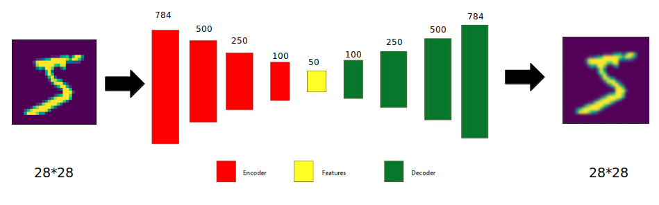
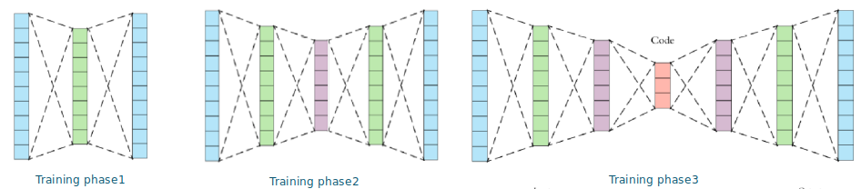
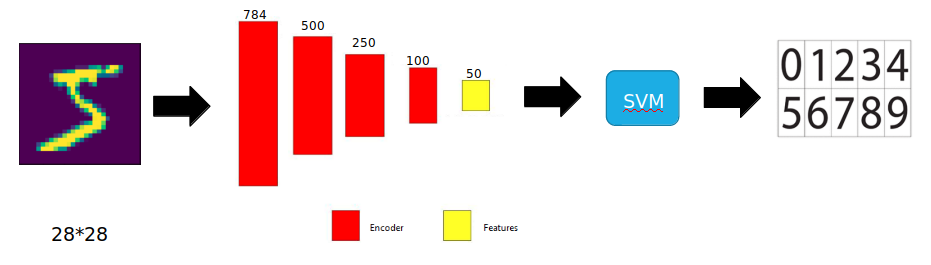
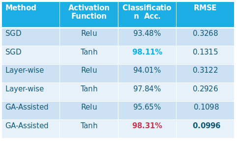

[](https://github.com/Asiyeh-Bahaloo/genetic-autoencoder/graphs/commit-activity)
# Genetic Algorithms for Evolving Deep Neural Networks
This repository contains the unofficial implementation of the [paper](https://https://arxiv.org/abs/1711.07655) "Genetic Algorithms for Evolving Deep Neural Networks" by Omid E. David and Iddo Greental. If you have ever wondered how one can use genetic algorithms (GAs) instead of conventional stochastic gradient descent (SGD), this is the right place to learn.

# Table of Contents  
1. [Description](#description)  
2. [How to Run?](#how-to-run)  
3. [Method](#method) 
4. [Result](#result)


# Description
In a genetic algorithm, a population of candidate solutions to an optimization problem evolves toward better solutions. Each candidate solution (chromosome) has a set of properties that can be mutated and altered. This repository provides the code and explanation needed to train a tied autoencoder using a genetic algorithm. You can find a comprehensive explanation in the [Method](#method) section.

# How to Run?
First you need to install all the dependencies:
```bash
pip install -r requirements.txt
```
Tto train the model change configs in configs/config.yaml then run:
```bash
python core/train.py
```
You can also give the configs with command line such as:
```bash
python core/train.py --output_dir "path_to_output"
``` 
When training finished it will produce the model weights and checkpoints. Edit the configs in configs/inference_config.yaml to test the model on a single test image:
```bash
python core/inference.py
``` 
### Folder Structure
Here is the structure of the project. core/models contains the models architectures.
```
.
├── configs
│   ├── config.yaml
│   └── inference_config.yaml
├── core
│   ├── inference.py
│   ├── models.py
│   └── train.py
├── imgs
├── notebooks
├── outputs
└── README.md
```

# Method
In this task, we have a tied auto encoder (i.e., the weights are shared between the decoder and encoder), and we want to train it on the MNIST dataset. The architecture of the model is shown in the figure below:



As you can see, we have a nine-layer autoencoder that we want to train to learn 50 representative image features. Since the autoencoder is tied, we used a layer-wise manner to train the auto encoder. This process is shown below:



So in the first training phase, we just train the 784-500 and 500-784 layers together. Technically speaking, this is just one layer that we use in the forward and backward passes. As you can see, this type of training can reduce the size of the whole parameters by half and still have them be equally performed. In the second training phase, we will fix the 784-500 layer and train the 500-250 layer, and so on, till all the layers are trained.

After finishing the auto-encoder training phase, we train the model on the classification task:



In this case, we used the 50 features (of each image) to train an SVM model for classification purposes. You can see the results in the result section.

## Genetic related factors
In our GA population, each chromosome is one set of weights for the autoencoder. The fitness for chromosome i is defined as fi = 1/RMSEi, where RMSE is the root mean squared error for chromosome i.
Given two parents, one offspring is created as follows: 
 - Crossover is performed by randomly selecting weights from the parents
 - Mutation is performed by replacing a small number of weights with zero

So we used crossover and mutation to create new generations instead of SGD in each training phase.

 # Result
These are the results in different scenarios:

 


